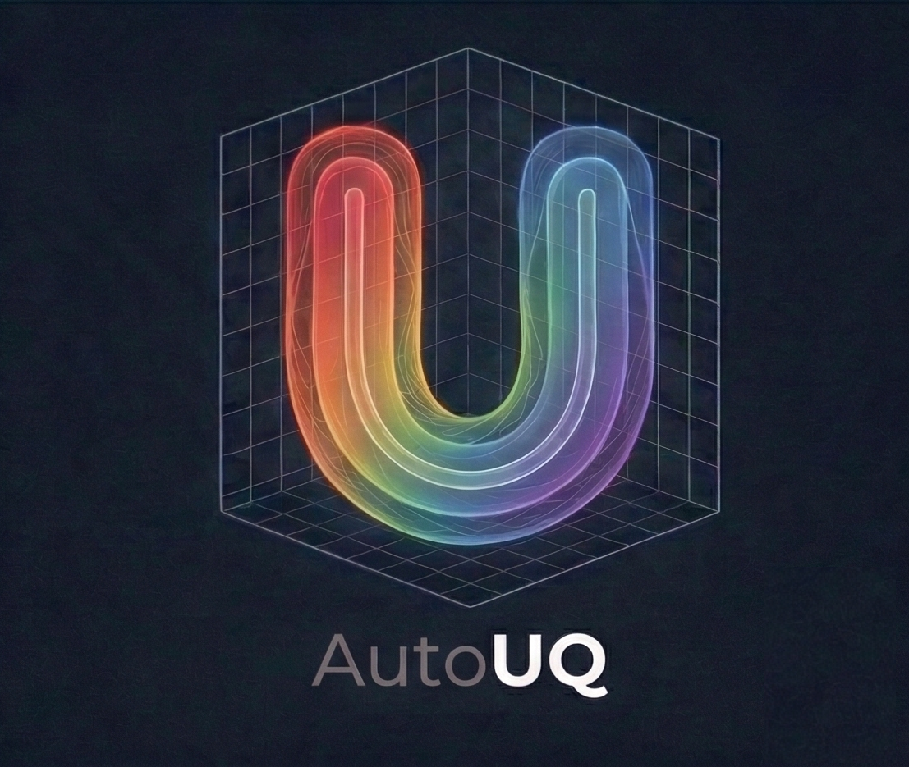

# AutoUQ 

## Installation

### Prereqiuisites

- [uv](https://github.com/astral-sh/uv): running scripts; managing virtual environments

### Development
For development, install with [`uv`](https://github.com/astral-sh/uv):
```bash
uv sync --extra dev
```

If contributing to the codebase, you can run
```bash
prek install
```
This installs the prek hooks so any pushed commits will pass the CI.

Runtime type checking with `beartype` is disabled by default for package
imports but enabled by default in tests. To enable it for another
command, set `RUNTIME_TYPECHECKING=true`:

```bash
RUNTIME_TYPECHECKING=true uv run python -c "import autouq"
```

The repository recommends the VS Code `ty` extension for editor type
checking. To switch off `ty` inlay hints personally, add the following
to your VS Code User Settings:

```json
{
  "ty.inlayHints.variableTypes": false,
  "ty.inlayHints.callArgumentNames": false
}
```


<!-- markdownlint-restore -->
<!-- prettier-ignore-end -->

<!-- ALL-CONTRIBUTORS-LIST:END -->
